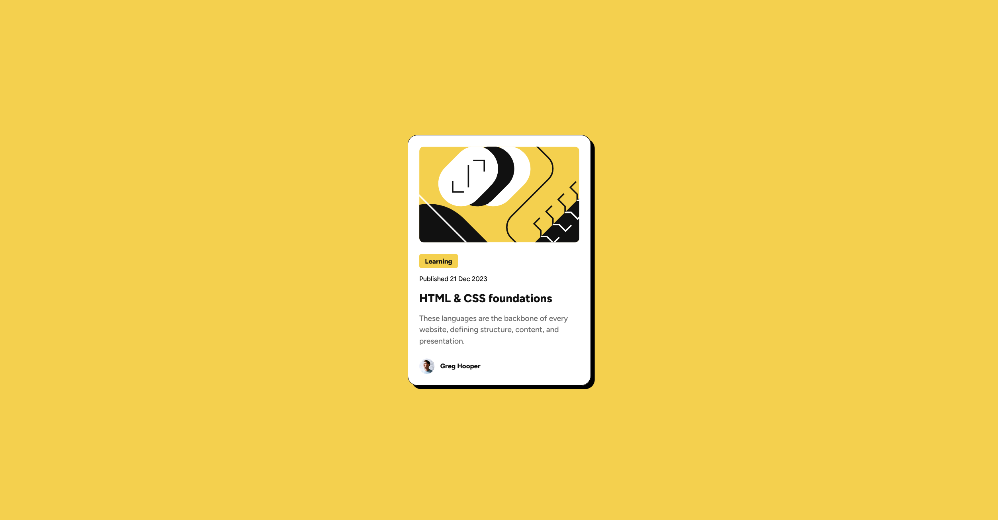

# Frontend Mentor - Blog preview card solution

This is a solution to the [Blog preview card challenge on Frontend Mentor](https://www.frontendmentor.io/challenges/blog-preview-card-ckPaj01IcS). Frontend Mentor challenges help you improve your coding skills by building realistic projects.

## Table of contents

- [Overview](#overview)
  - [The challenge](#the-challenge)
  - [Screenshot](#screenshot)
  - [Links](#links)
- [My process](#my-process)
  - [Built with](#built-with)
  - [What I learned](#what-i-learned)
  - [Continued development](#continued-development)
  - [Useful resources](#useful-resources)
- [Author](#author)
- [Acknowledgments](#acknowledgments)

**Note: Delete this note and update the table of contents based on what sections you keep.**

## Overview

### The challenge

Users should be able to:

- See hover and focus states for all interactive elements on the page

\*\*Note: The expected states were introduced for heading text of the card only.

### Screenshot



\*\*Note: Size of the picture reduced with https://tinypng.com/

### Links

- Solution URL: [Add solution URL here](https://github.com/virus0bt/blog-preview-card)
- Live Site URL: [Add live site URL here](https://virus0bt.github.io/blog-preview-card/)

## My process

### Built with

- Semantic HTML5 markup
- CSS custom properties
- Flexbox
- Mobile-first workflow

### What I learned

- CSS custom properties to keep everything in one place and avoid repetitions.
- Using CSS clamp() function to calculate website elements sizes for different viewports.

```css
.card__item-title {
  font-size: clamp(1.25rem, 0.375vw + 1.16rem, 1.5rem);
  font-weight: 800;
}
```

- Improved knowledge on how to use flexbox to set different elements position in the project.

```css
.card__item-text {
  display: flex;
  flex-direction: column;
  align-items: flex-start; /* child elements don't use whole line width */
  gap: 0.75rem;
  padding-block: 1.5rem;
}
```

- How to use box-shadow instead of border and how to set a shadow inside an element.

```css
:root {
  --box-shadow-outside: 8px 8px 0 0 var(--color-card-shadow);
  --box-shadow-inside: inset 0 0 0 1px var(--color-card-shadow);
}
```

### Continued development

Use this section to outline areas that you want to continue focusing on in future projects. These could be concepts you're still not completely comfortable with or techniques you found useful that you want to refine and perfect.

- Usage of flexbox in more complex projects.
- Usage of clamp(), min() and max() css functions.
- Usage of CSS custom properties.
- Focus more on accessibility and semantic html.
- Naming classes of website elements.

### Useful resources

- [clamp() function](https://css-tricks.com/almanac/functions/c/clamp/) - My basic source of information about clamp() css function. It helped to make card elements responsive without media queries.
- [clamp() function calculations](https://medium.com/@projectluis/the-magic-of-clamp-in-css-80c6b75d864a) - More about clamp() function + examples of calculations. With additional help of ChatGPT I finally understand the math behind that function.

- [general source of information](https://medium.com/@projectluis/the-magic-of-clamp-in-css-80c6b75d864a)

## Author

- Frontend Mentor - [@virus0bt](https://www.frontendmentor.io/profile/yourusername)

## Acknowledgments

This is where you can give a hat tip to anyone who helped you out on this project. Perhaps you worked in a team or got some inspiration from someone else's solution. This is the perfect place to give them some credit.

**Note: Delete this note and edit this section's content as necessary. If you completed this challenge by yourself, feel free to delete this section entirely.**
